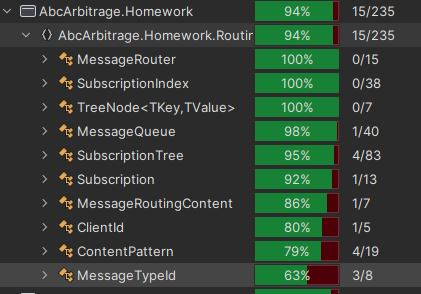
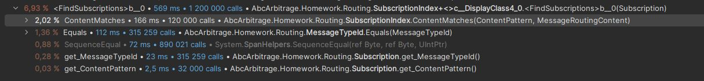
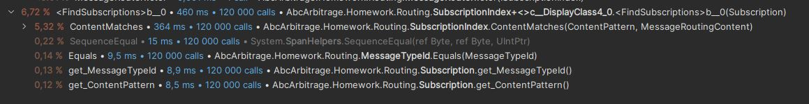
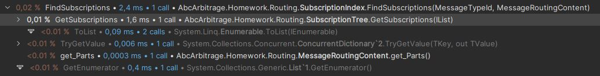
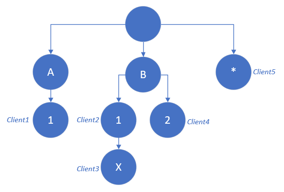

# Routing exercise Answers

Complete this document with your answers.

----

### Candidate Name: Simon Gelbart

### Date: 03/11/2023

-----

## A. Implement SubscriptionIndex

- A2.  Write the names of the tests you added here:

*`ShouldExcludeRoutableSubscriptionWithRemovedClientSubscription`*  
To test the deletion of *Subscriptions* for a given *ClientId*

*`ShouldExcludeRoutableSubscriptionWithRemovedSubscription`*  
To test the deletion of a *Subscription*

*`ShouldNotFindMatchingRoutableSubscriptionWithPatternTooLong`*  
To test border case when a user put a pattern that makes no sens (too long)

- A3.  Briefly document your approach here (max: 500 words)

With Rider I did a performance analysis of the unitary test.  
Having only unitary test as a base for the performance analysis was not the best way to find any relevant cases because the design was not stressed enough.

Hence, I started to write some possible improvement but decided to wait until answering question **C** in order to implement them.

## C. Improve SubscriptionIndex performances (Bonus)

- C1.
- Did you find a solution where the benchmark executes in less that 10 microseconds?  
**Yes**

| Method       |     Mean |     Error |    StdDev |
|--------------|---------:|----------:|----------:|
| GetConsumers | 1.141 μs | 0.2683 μs | 0.0147 μs |

- If you did, briefly explain your approach (max: 500 words):

My first approach while designing the SubscriptionIndex was to have a fast solution in order to do the test.  
It was a simple `HashSet<Subscription>` (Not thread-safe)  
In this case we had to check all the element of the list, with the number of subscription in the benchmark it was really poorly designed.

| Method       |     Mean |   Error |   StdDev |
|--------------|---------:|--------:|---------:|
| GetConsumers | 26.08 ms | 7.62 ms | 0.401 ms |

In my second approach, I tried to decreased the number of Subscription to check.  
I stored them in a `ConcurrentDictionary<MessageTypeId,HashSet<Subscription>>`  
In this case we only check the element for a given MessageType, it is already much better performance wise

| Method       |     Mean |     Error |    StdDev |
|--------------|---------:|----------:|----------:|
| GetConsumers | 2.620 ms | 0.6573 ms | 0.0360 ms |

In the end, we wanted to avoid most of the check and find the data with the shortest way.   
I changed the HashSet to a custom tree structure following the ContentPattern and stored the subscription at the right TreeNode.  
You can find the implementation in `Routing/SubscriptionTree.cs`  
With this way I only have to follow the next node that contains  

|       Method |     Mean |     Error |    StdDev |
|------------- |---------:|----------:|----------:|
| GetConsumers | 1.141 μs | 0.2683 μs | 0.0147 μs |

*Example*

| Client    |  ContentPattern |
|-----------|----------------:|
| *Client1* |      ["A", "1"] |
| *Client2* |      ["B", "1"] |
| *Client3* | ["B", "1", "X"] |
| *Client4* |      ["B", "2"] |
| *Client5* |           ["*"] |

*Tree Representation*

------

### Candidate survey (optional)

The questions below are here to help us improve this homework.

1. How did you find this homework? (Easy, Intermediate, Hard)  
Intermediate (The last question was really interesting)

2. How much time did you spend on each questions?
- A : Approx. 1h (time to read and understand the solution + the answers)
- B : 20~30 min
- C : 1h~1h30
